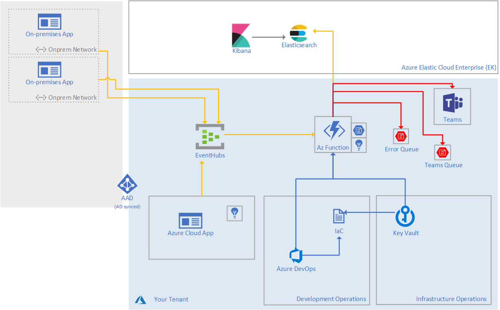

# Elastic Search ingestion thru Event Hubs and Azure functions with Teams channel notification

This project implements a typical architecture ingesting data thru Event Hub, transforming and validating the data into Azure Functions and posting them to an Azure Elastic Cluster. This architecture is coming from a real project for Axa Investment Managers. The core idea was to replace existing Logstash, Kafka in on premise VM into a full Platform and Sorftware as a Service architecture.

The code present in this repository is a simplified version of the full project. All the Infrastructure as Code elements, all the built elements has been fully removed as they were specific to Axa Investment Managers. Note that Azure Dev Ops (ADO) has been used as the platform to manage the infrastructure creation as well as the update for the components, emulators and Azure function.

ADO allows to build, test and publish as reusable artifact the various components. They were directly referenced in the Emulators. In this project, the project reference is used. We do recommend to put in place a similar system so your developers will always have an up to date version of the logger.

## Architecture

The following schema explains the all up architecture.

On the left you can find the on-premise apps. Thos applications can post as well into the Event Hubs
On the right you can find the Azure based solution. Few notes on the architecture:
- You should make it fully deployable thru Infrastructure as Code with all secrets managed in a Key Vault. The code in this repository supports Key Vault. The specific deployment and build elements for Infrastrucre as Code are not present.
- The all up architecture is fully Platform as a Service and very scalable with Event Hub for the log ingestion and Azure Functions to process them
- 2 queues are put in place to manage the notification in Teams. Notifications are done thru a Webhook. The Webhook has threshold, reason why queues are existing
- A table is existing with additional application related information like the specific Axa “trigram” (3 character for every application) as well as the application Teams Webhook
- Elastic Cloud Enterprise is hosted in Azure. That said, it will work with an Elastic cluster hosted anywhere else.
Helpers has been developed to log directly in Event Hub creating reusable artefact for the specific languages:
   - [.NET NLog](./src/Components/Dotnet/NlogTarget/Nlog.Eventhub)
   - [.NET Log4net](./src/Components/Dotnet/Log4netAppender/Log4net.Eventhub)
   - [Java Logback](./src/Components/Java)
   - [Node Log4js](./src/Components/Node)
   - [Python](./src/Components/Python) (specific implementation)

## Multi language helpers

The helpers has been built on the most used logging components which existed. The languages supported are .NET, Java, Node and Python. The .NET logger implements the 2 most used nugets Log4Net and NLog.

In the case of the .NET, Java and Node implementation, a specific appender has been developped to support Event Hub as an output. 

You will find more direct information into every speficic logger:
- [.NET NLog](./src/Components/Dotnet/NlogTarget/Nlog.Eventhub)
- [.NET Log4net](./src/Components/Dotnet/Log4netAppender/Log4net.Eventhub)
- [Java Logback](./src/Components/Java)
- [Node Log4js](./src/Components/Node)
- [Python](./src/Components/Python)

## Emulators

Fully functional emulators has been created to help ramping up. They are available in the [Emulators]()./src/Emulators) folder.

The following .NET Emuators are available:
- [Emulator DI](./src/Emulators/Dotnet/EmulatorDI)
- [Emulator Log4net](./src/Emulators/Dotnet/EmulatorLog4net)
- [Emulator NLog](./src/Emulators/Dotnet/EmulatorDI)
- [Emulator using natif Event Hub SDK](./src/Emulators/Dotnet/EmulatorDI)

The [Java Emulator](./src/Emulators/Java) is using logback as the main logging element.

The [Node Emulator](./src/Emulators/Node) is using Log4js.

## The transformation Azure Function

The [Azure Function](./src/Transformation) is validating that the logs are correctly formes, that all mandatory element are present, that some format for dates are respected, that some elements exists in a spefic table. Those are examples of what can be done. It's clear that you can validate much more elements.

Few validations example like date formats, upper text are present into this implementation.

## Error posting into Teams channel

In case one of the previous elements is not valid, they are placed in a queue. The error queue is processed every minute and a concatenation of the errors are posted into specific Teams channel using a Webhook. You'll find more information as well on how to make this happening [here](./src/Transformation).
