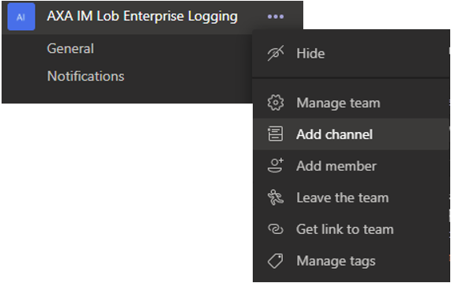
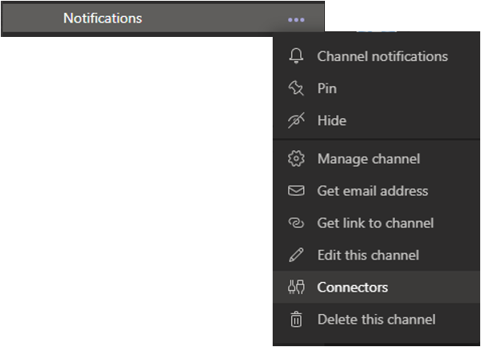
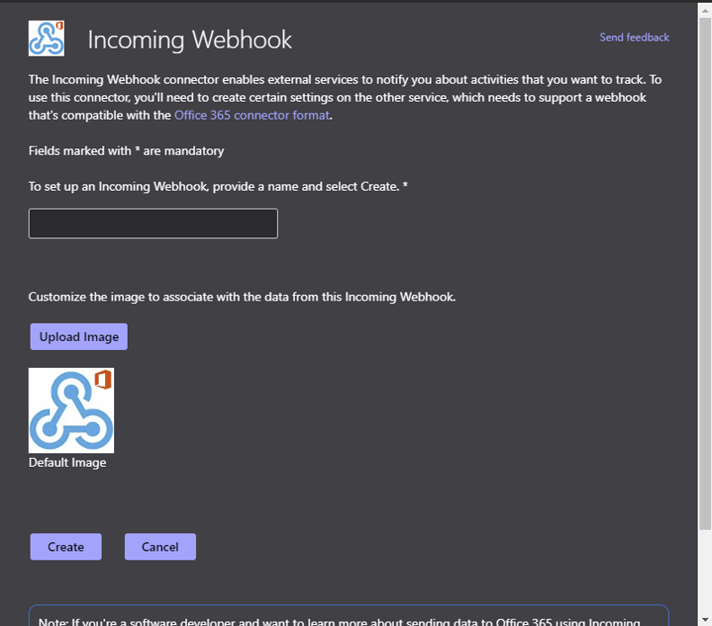

# Logging Transformation and error posting in Teams channel thru an Azure Function

## Purpose of the Azure Function

The Azure function has 3 different purposes:
- Make sure all what is sent to Event Hub follows some specific rules. In the present code, we have the following examples:
    - Date are in an ISO8610 format yyy-MM-ddThh:mm:ss(.ffffffff)Z where (.ffffffff) are optionals
    - There is a specific field called trigram which is a 3 letters accronym. The table of thruth is stored into an Azure table
    - A field has to be in upper case
    - Some fields must exist
- Manage an error queue
- Post concatanated messages into Teams channel thru Webhook

## Function trigger

The function is trigged automatically every time an event arrives on the right Event Hubs.

```csharp
[FunctionName("logging_transformation")]
public static async Task Run([EventHubTrigger("%EMP_EVENT_HUB_NAME%", Connection = "EMP_EVENTHUB_CONNECTION_STRING")] EventData[] events, ILogger log, ExecutionContext executionContext)
```

Please note that you can use environment variables for all the elements. This will allow you to store the secrets and parameters outside of the code itself. For example, anything in the function declaration that is between % is an environement variable. So in this case, the ```%EMP_EVENT_HUB_NAME%``` is an environement variable. The ```EMP_EVENTHUB_CONNECTION_STRING``` is an entry in the configuration section which is at the end of the day as well an environment variable.

## Environement variable needed

Here is the list of environement variable you'll need:

App Setting | Expected format (or value example) | Meaning
---|---|---
AzureWebJobsStorage | "DefaultEndpointsProtocol=https;AccountName=[name];AccountKey=[key]" | Storage account connection string for storing logs and displaying them in the Monitor tab in the portal
FUNCTIONS_WORKER_RUNTIME | "dotnet" | The language worker runtime to load in the function app
FUNCTIONS_EXTENSION_VERSION | "~3" | The version of the Functions runtime to use in this function app
APPINSIGHTS_INSTRUMENTATIONKEY | E.g: "5dbdd5e9-af77-484b-9032-64f83bb83bb" | Key of the AP Insights attached to the function
WEBSITE_CONTENTAZUREFILECONNECTIONSTRING | DefaultEndpointsProtocol=https;AccountName=[name];AccountKey=[key] | For Consumption & Premium plans only. Connection string for storage account where the function app code and configuration are stored
WEBSITE_TIME_ZONE | W. Europe Standard Time | Time Zone
WEBSITE_CONTENTSHARE | E.g: "azure-function-app-name091999e2" | For Consumption & Premium plans only. The file path to the function app code and configuration. Used with WEBSITE_CONTENTAZUREFILECONNECTIONSTRING
WEBSITE_RUN_FROM_PACKAGE | "https://xxxxxxx" | Enables your function app to run from a mounted package file
EMP_EVENTHUB_CONNECTION_STRING | "Endpoint=sb://<FQDN>/;SharedAccessKeyName=<KeyName>;SharedAccessKey=<KeyValue> | EventHub namespace connection string
EMP_EVENT_HUB_NAME |"valid-event-hub-name" | Event Hub name
EMP_STORAGE_ACCOUNT_CONNECTION_STRING | "DefaultEndpointsProtocol=https;AccountName=[name];AccountKey=[key]" | Supporting Storage account to store the queues and the storage table for the emp app logic
EMP_STORAGE_ACCOUNT_ERROR_QUEUE_NAME | "valid-queue_name" | Name of the queue that holds the log validation errors
EMP_STORAGE_ACCOUNT_TEAMS_QUEUE_NAME | "valid-queue_name"| Name of the queue that holds the errors to be posted in the teams channel
EMP_TRIGRAM_TABLE_NAME |"validtablename"| Name of the table that holds the trigram information
EMP_ELASTIC_SEARCH_CLUSTER_URI | "https://xxxxxxxxxxxxx.westeurope.azure.elastic-cloud.com:port" | URI of the ElasticSearch cluster
EMP_ELASTIC_SEARCH_API_ID | E.g: "ASfdsfd9efwefQQQ"| API ID of the Elastic Search cluster
EMP_ELASTIC_SEARCH_API_KEY | E.g: "QWDFGHdrgdgrd" | API Key of the Elastic Search cluster
EMP_WEBHOOK_TEAMS_ACTIVITY_IMAGE | "https://<valid_address>" | Image of the Teams Channel
EMP_WEBHOOK_TEAMS_URL | "https://<valid_address>" | WebHook URL of the Teams Channel to be notified by the error
EMP_KIBANA_URL | " https://yyyyyyyyyyyyyyy.westeurope.azure.elastic-cloud.com:port" | Kibana URL

## Message validation

The validation happens in the [JsonLogEntry](./Model/JsonLogEntry.cs) class.

The date validation can be sometimes complicated depending on the format. One good trick is to use the ```TryParseExact``` function and pass the exhausfive list of elements you want to validate. The following is doing this:

```csharp
public static bool IsValidIso8601Date(string dateToValidate)
{
    string[] validFormats = new string[]
    {
        @"yyyy-MM-dd\THH:mm:ss\Z",
        @"yyyy-MM-dd\THH:mm:ss.f\Z",
        @"yyyy-MM-dd\THH:mm:ss.ff\Z",
        @"yyyy-MM-dd\THH:mm:ss.fff\Z",
        @"yyyy-MM-dd\THH:mm:ss.ffff\Z",
        @"yyyy-MM-dd\THH:mm:ss.fffff\Z",
        @"yyyy-MM-dd\THH:mm:ss.ffffff\Z",
        @"yyyy-MM-dd\THH:mm:ss.fffffff\Z",
    };

    DateTime dateChecked;
    return DateTime.TryParseExact(dateToValidate, validFormats, CultureInfo.InvariantCulture, DateTimeStyles.AssumeUniversal, out dateChecked);
}
```

For validation, you can use as well regEx matching like in the following example validating if the chain is upper case:

```csharp
// level must be upper case
string regLevelValidation = "[^AZ]";
var match = Regex.Match(emp.Level, regLevelValidation);
if (!match.Success)
{
    errorMessage += $"ValidateJsonLogEntry: {nameof(Level)} field is not uppercase. ";
    isValid = false;
}
```

You can imagine any kind of validation. 

## How to setup a Teams channel to receive notifications from outside

This is done thru a Webhook. It's a specific application that has been developped by Microsoft to allow simple notification scenarios.

### Create a specific channel for notifications

You can (or not) create a specific channel for notifications, for this, select your Teams, click the 3 dots on the right and select *Add chanel*



Create a channel and name it the way you want.

### Add a Webhook

Go to the channel you want to receive the notifications. Then click the 3 dots and select *Connectors*



Search for *Webhook* and click *Add*, fill the name of your Webhook. This will be the name displayed once you'll post something on Teams from it. You can change the picture as well.



Copy the URL of your Webhook and keep it secret!

### Calling a Webhook

See [how to send a message to webhook](https://docs.microsoft.com/en-us/microsoftteams/platform/webhooks-and-connectors/how-to/connectors-using)

### Creating a MessageCard

Webhook supports only Office 365 Message Cards. This is different than the Adaptive Card. Adaptive Card won't work at all. 

See [the message card playgound](https://messagecardplayground.azurewebsites.net/) to understand the structure.

The example uses the *MessageCardModel* nuget, source can be found here: https://github.com/poychang/Message-Card-Model

You can as an example display a message, a specific image, couple of elements, create a link, etc. Even if not as reach as the Adaptive Card, this allows quite some scenarios. Once the nuget installed, you can create a card like this:

```csharp
// Prepare the message
MessageCard card = new MessageCard();
card.Title = "Big error!";
card.Text = $"Error: {message}";

card.Sections = new List<Section>
{
    new Section
    {
        ActivityTitle = "Laurent Ellerbach",
        ActivitySubtitle = DateTime.Now.ToString(),
        ActivityImage = "https://azurecomcdn.azureedge.net/cvt-19d7f8c962d44deff16d53cd47bc713d44e82ab3050087c79bc485e1d394fa2a/images/shared/services/devops/pipelines-icon-80.png",
        Facts = new List<Fact>
        {
            new Fact{ Name = "Trigram", Value = "ABC" },
            new Fact{ Name = "Severity:", Value = "ERROR" }
        },
        Text = "Detailed error or anything else"
    }
};

card.Actions = new List<IAction>
{
    new OpenUriAction
    {
        Type = ActionType.OpenUri,
        Name = "View on site",
        Targets = new List<Target>{ new Target { OS = TargetOs.Default, Uri = "https://dilegosite.azurewebsites.net/" } }
    }
};

var json = JsonConvert.SerializeObject(card);
```

**Warnings: **
- Images seems to support only png
- Images must be in an https url
- Image size seems to matter

As an alternative, you can just post a text, the json is then extremly simple: 

```csharp
var json = $"{{\"Text\": \"Error in log: {message}\"}}";
```

### Posting the card to the webhook

In order to post the message to the webhook, you need to serialize the card and post it as application/json as a content type. In case of error, you'll get an invalid parameter.

```csharp
var request = (HttpWebRequest)WebRequest.Create(url);

var postData = json;
var dataToSend = Encoding.ASCII.GetBytes(postData);

request.Method = "POST";
request.ContentType = "application/json";
request.ContentLength = dataToSend.Length;

using (var stream = request.GetRequestStream())
{
    stream.Write(dataToSend, 0, dataToSend.Length);
}

var response = (HttpWebResponse)request.GetResponse();

var responseString = new StreamReader(response.GetResponseStream()).ReadToEnd();
```

### Thresholds

All Webhook have thresholds to avoid attacks. Looking at the specific Teams channel ones, we've decieded to align to the lowest threshold which is about 1 post per minute. So a function is trigged every minute to check the various queues, sort the error messages and post them into the correct Webhook.

The queue management is simple, nothing statys in the queue, once read, the data are deleted. As the message size is limited as well, only the first few messages are presented into the cards.